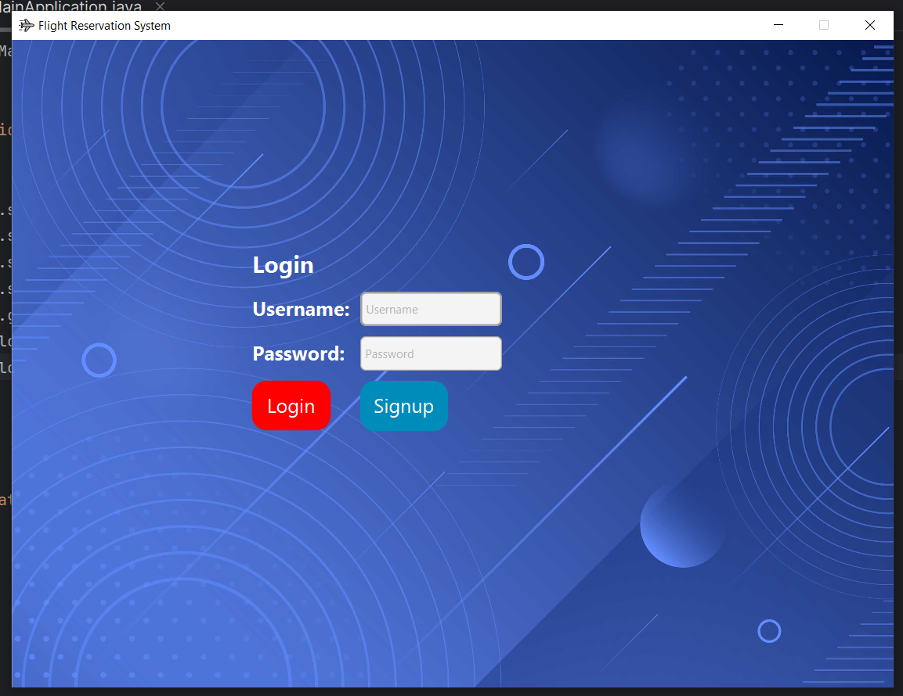
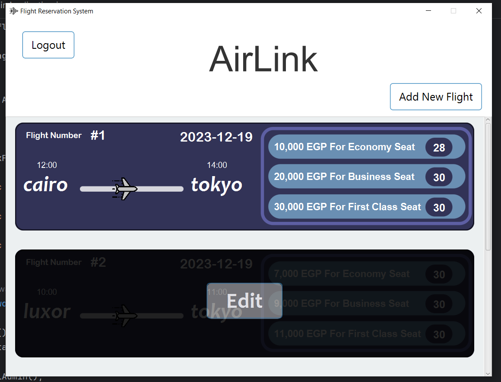
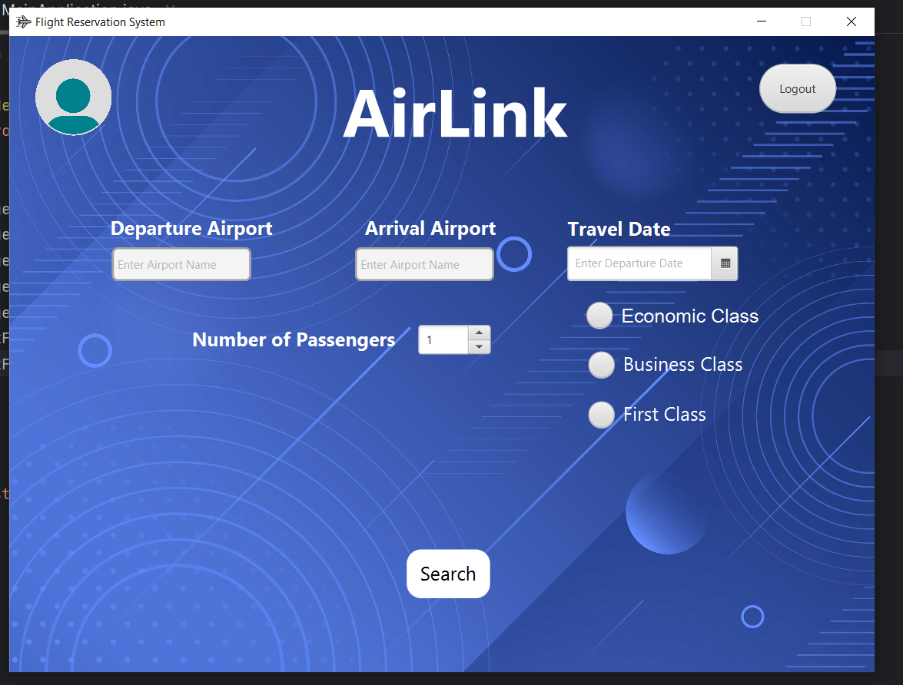
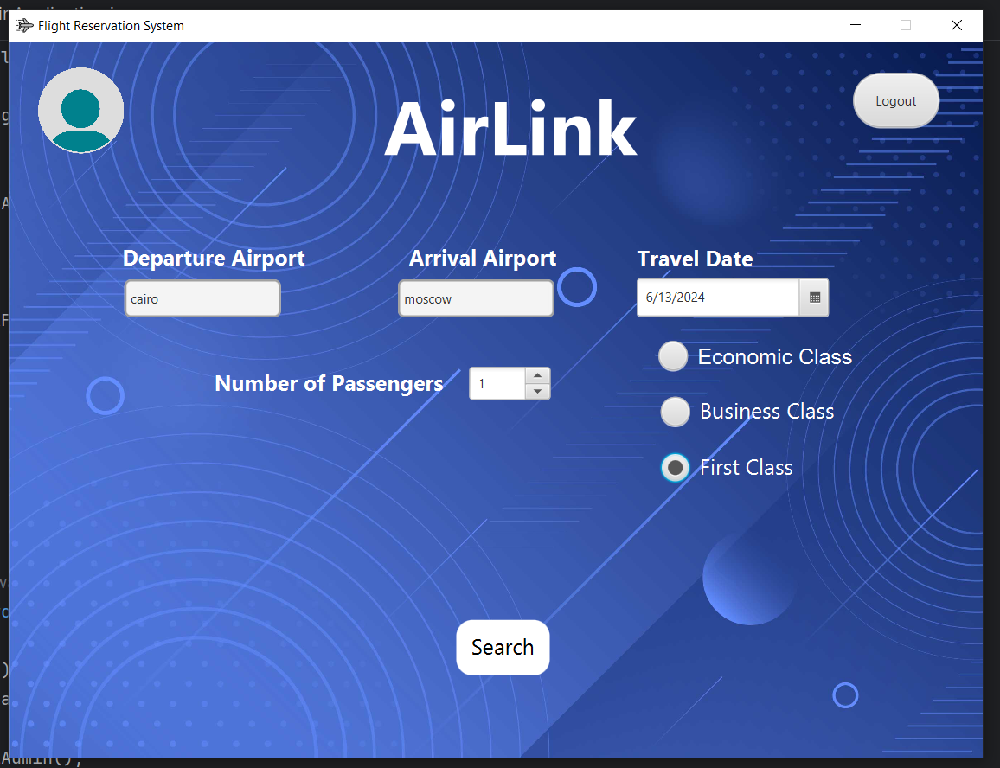
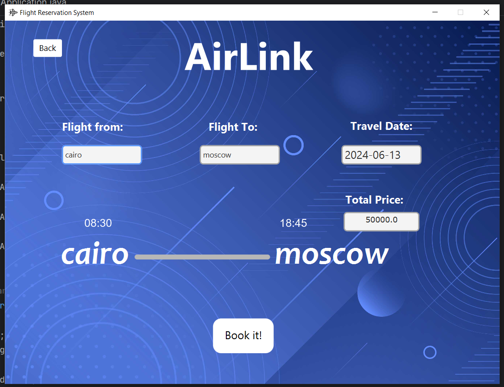
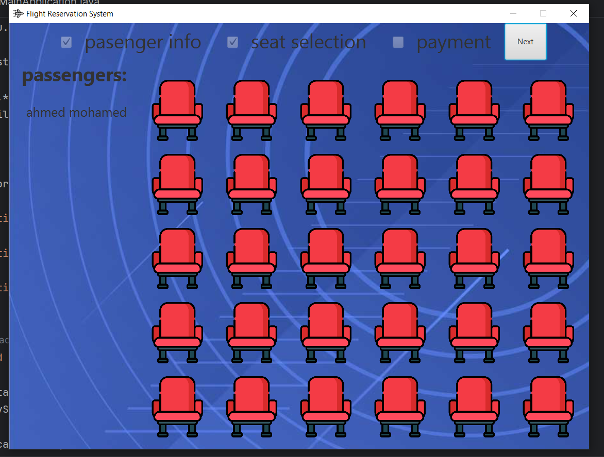
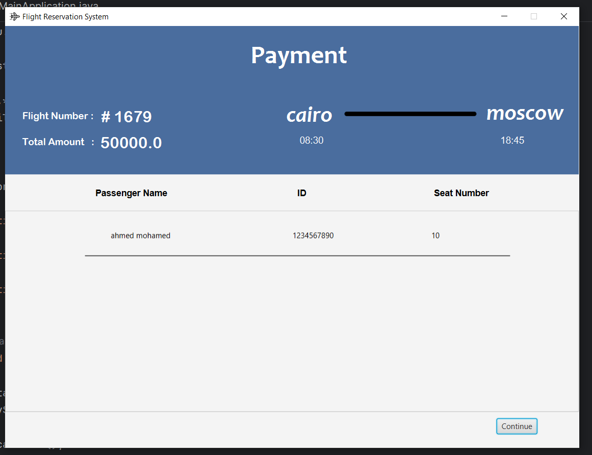
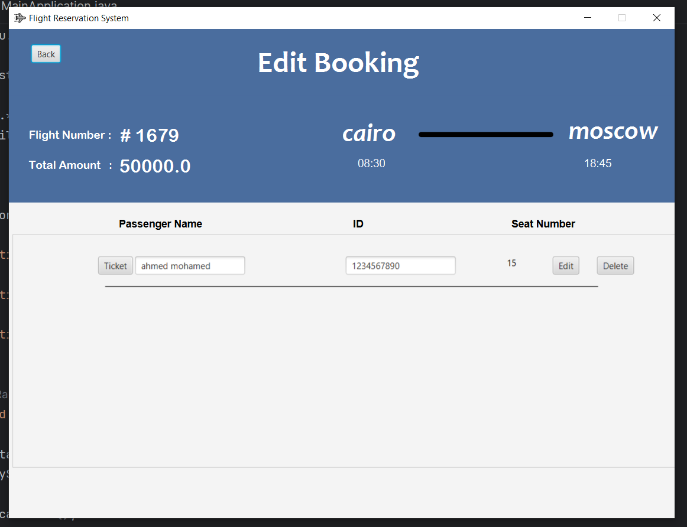

# Airlink
## 📑 Content
- [About](#-about)
- [Screenshots](#-screenshots)
- [Other Contributors](#other-contributors)

## 📖 About
Welcome to our Flight Booking System! This desktop application is designed to streamline the process of searching, selecting, and booking flights for your travel needs. Our system offers a user-friendly interface that makes trip planning convenient and efficient.

Our development process emphasizes the application of all Object-Oriented Programming (OOP) concepts, including: Encapsulation, Abstraction, Inheritance and Polymorphism.

We have developed this project using the Java programming language, leveraging its robust features and cross-platform capabilities. Additionally, we have implemented a graphical user interface (GUI) using JavaFX to provide an intuitive and interactive user experience.

### Functionalities
- **Flight Search**: Users enter their desired travel details such as departure and destination airports, dates, and any additional preferences. The system then queries the airlines and reservation systems to retrieve available flight options.
- **Flight Selection**: The system presents the search results to the user, displaying relevant flight options based on their search criteria. Users can compare flights based on factors like price, departure and arrival times, and flight duration.
- **Seat Selection**: Once users have chosen a flight, they can select their preferred seat(s) based on availability. The system provides a seating map or layout of the aircraft, allowing users to choose seats according to their preferences, such as window or aisle seats, proximity to exits, or specific class (economy, business, first).
- **User Information**: Users provide their personal details, such as name, contact information, and any special requirements or requests. This information is necessary for creating a booking and ensuring a smooth travel experience.
- **Pricing and Payment**: The system calculates the total cost of the flight, including the base fare, taxes, fees, and any additional services selected by the user. Users then proceed to make the payment using a preferred payment method, such as credit card or debit card.
- **Booking Confirmation**: Once the payment is successful, the system generates a booking confirmation that includes the flight details, seat assignments, and other relevant information.
- **Manage Booking**: Users can access their bookings through the flight booking system to make changes or cancellations if allowed by the airline's policies.
- **Flight and Inventory Management**: Admins are responsible for managing flight information and inventory within the system. This includes adding new flights, updating flight schedules, managing seat availability, and making adjustments to flight details as needed.

## 📷 Screenshots
- ### Login and Signup

- ### Admin Part

- ### User Part

- ### User Profile

## Other Contributors
- [Osama Mahmoud](https://github.com/Osama-Mahmoud1)
- [Eslam Ahmed](https://github.com/Eslam-Ahmed007)
- [Eslam Amr](https://github.com/Eslam-Amr)
